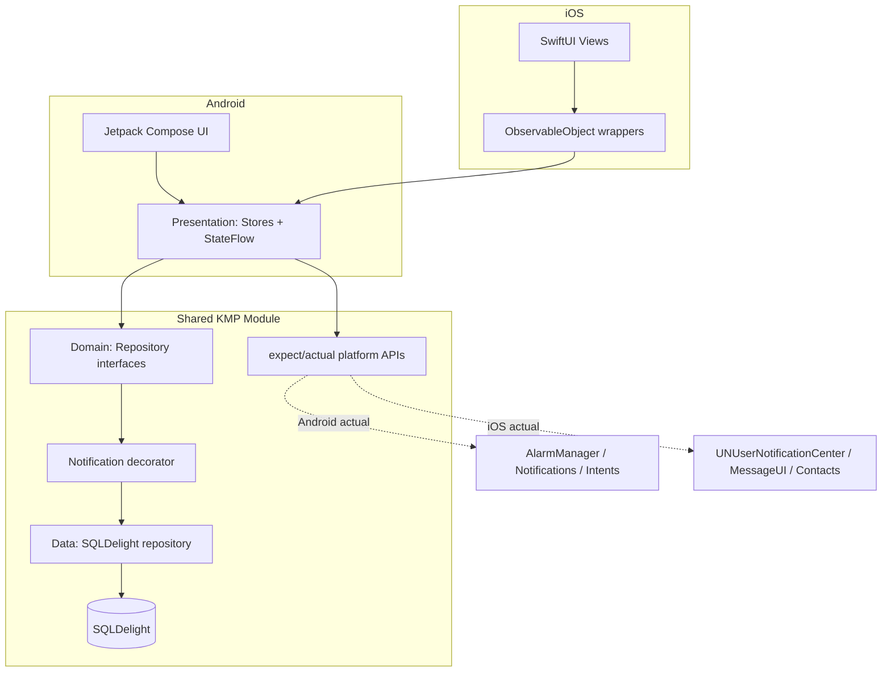

# Witness

**Accountability that actually bites.** Set a goal with a deadline, name a witness from your contacts, and commit to a confession if you miss it. Hit the goal and you log the win. Miss it, and the app hands you a one-tap message to send your witness — no wriggling out.

> Working title. The point of the app is that a real person is watching, and you never need them to install anything.


---

## What it is

Most habit and accountability apps run on the honor system: you tap "done" and nobody is the wiser. Witness puts a real person and a real consequence behind a specific deadline. You declare a one-off commitment, pick a witness from your phone's contacts, and write the confession that gets sent if you fall short. The witness is notified up front, so someone is genuinely expecting you to follow through — but they only ever receive a normal text message, so there is no social network to join and nothing for them to download.

The interesting engineering story is that the entire product runs on **one shared Kotlin Multiplatform core with fully native UIs** — Jetpack Compose on Android and SwiftUI on iOS — and no backend at all. State, notifications, and the confession flow are handled on-device.

## Demo

<!-- TODO: drop in a short screen-capture GIF here once the app is running -->
<!-- TODO: add 3–4 screenshots: create commitment, witness picker, deadline reminder, confession -->

| Android | iOS |
| --- | --- |
| _screenshot_ | _screenshot_ |

<!-- TODO: App Store and Google Play links once published -->

## Features

- Create a one-off commitment with a goal and a hard deadline.
- Pick a witness from your contacts; they get a heads-up text when named.
- Write a custom confession that is sent to the witness if you miss.
- Deadline reminders via native local notifications.
- Optional photo proof when you complete a goal.
- A running record of kept versus broken promises.
- Fully offline. No account, no server, no data leaving the device.

## Why I built it

I wanted a focused project that demonstrates production Kotlin Multiplatform the way real teams ship it: shared business logic, native UI on each platform, and clean handling of the genuinely hard cross-platform problems. The accountability concept is deliberately small in scope but exercises everything that matters — persistence, scheduling, platform interop, and a Kotlin-to-Swift bridge that a native iOS UI can consume comfortably.

## Architecture

A single shared module holds the domain, data, and presentation logic. Each platform owns its UI and talks to the shared layer through a thin, idiomatic bridge.



The presentation layer exposes immutable UI state as Kotlin `Flow` / `StateFlow` and actions as plain functions. On Android, Compose collects the flow directly. On iOS, [SKIE](https://skie.touchlab.co/) rewrites the generated framework so suspend functions become Swift `async` and flows become `AsyncSequence`, and a small SwiftUI `ObservableObject` wraps each shared store and republishes its state as `@Published`. That wrapper is the whole bridge between Kotlin and SwiftUI.

Deadline scheduling is wired in as a repository decorator (`NotifyingCommitmentRepository`) rather than being called from every store, so the presentation layer never has to think about alarms or notifications.

The platform-specific work — scheduling deadline reminders, sending the confession, and reading contacts — is isolated behind `expect`/`actual` declarations, with Android implementations using `AlarmManager`, notifications, and intents, and iOS implementations using `UNUserNotificationCenter`, `MessageUI`, and the Contacts framework.

## Tech stack

| Concern | Choice |
| --- | --- |
| Shared language | Kotlin Multiplatform |
| Android UI | Jetpack Compose |
| iOS UI | SwiftUI |
| Kotlin ↔ Swift interop | SKIE |
| Async | Coroutines + Flow / StateFlow |
| Persistence | SQLDelight |
| Dependency injection | Manual (composition roots per platform) |
| Dates | kotlinx-datetime |
| Architecture | Layered domain / data / presentation with StateFlow-driven stores |
| Tests | kotlin.test, JUnit |

## Project structure

```
witness/
├── shared/                       # Kotlin Multiplatform core
│   └── src/
│       ├── commonMain/kotlin/
│       │   ├── domain/           # entities (Commitment, Witness, Record) + repository interfaces
│       │   ├── data/             # SQLDelight + in-memory repository impls
│       │   ├── notification/     # DeadlineNotifier + repository decorator that schedules alarms
│       │   └── presentation/     # Stores exposing StateFlow / Flow of UI state
│       ├── commonMain/sqldelight/# .sq schema and typed queries
│       ├── androidMain/kotlin/   # Android actuals (AlarmManager, SQLite driver)
│       ├── iosMain/kotlin/       # iOS actuals + IosAppContainer composition root
│       └── commonTest/kotlin/    # shared unit tests
├── androidApp/                   # Jetpack Compose application (screens + platform integrations)
├── iosApp/                       # SwiftUI application (Xcode project)
├── design/                       # UI mockups
├── build.gradle.kts
└── settings.gradle.kts
```

## Getting started

### Requirements

- Android Studio (latest stable) with the Kotlin Multiplatform plugin
- Xcode (latest stable) for the iOS app
- JDK 17+

### Android

1. Open the project root in Android Studio.
2. Select the `androidApp` run configuration.
3. Run on an emulator or device.

### iOS

1. Build the shared framework: `./gradlew :shared:assembleXCFramework` (or let the CocoaPods/SPM integration handle it).
2. Open `iosApp/iosApp.xcodeproj` (or the workspace) in Xcode.
3. Select a simulator and run.

## Key technical decisions

**Shared logic, native UI.** Compose Multiplatform would have shared the UI too, but native UI per platform is how many production KMP codebases actually operate, especially when KMP is adopted into existing native apps. It keeps each platform's UX best-in-class and demonstrates the harder skill: clean Kotlin-to-Swift interop rather than the everything-shared shortcut.

**SKIE for interop.** Raw Kotlin suspend functions and flows are awkward to consume from Swift. SKIE makes the generated API feel native — `async` functions, `AsyncSequence` flows, and real Swift enums for sealed classes — which keeps the SwiftUI layer clean and idiomatic.

**SQLDelight over a simpler key-value store.** Commitments, witnesses, and history are relational and queried, so type-safe SQL shared across both platforms is the right fit and avoids hand-rolled serialization.

**No backend.** Reaching the witness through native messaging and keeping all data on-device removes server cost, sync complexity, and the cold-start problem a social app would otherwise face. It also makes a clean privacy story: nothing leaves the phone.

## Roadmap

**Product**
- [ ] Escalating stakes for repeat misses
- [ ] "Brag" message to the witness on success, not just confession on failure
- [ ] Verified check-ins via Health Connect / HealthKit for fitness goals
- [ ] Widgets and Live Activity / Dynamic Island support

**Engineering**
- [ ] Introduce Koin as a shared DI container (replaces the two hand-wired composition roots)
- [ ] Add a domain use-case layer between stores and repositories
- [ ] Convert store outputs to `StateFlow` via `stateIn` and hoist the countdown ticker
- [ ] Split the larger screen files (Create, Home, Record) into per-component files
- [ ] Extract a small design-system module for the reused Compose primitives
- [ ] Wire up GitHub Actions CI plus detekt / ktlint